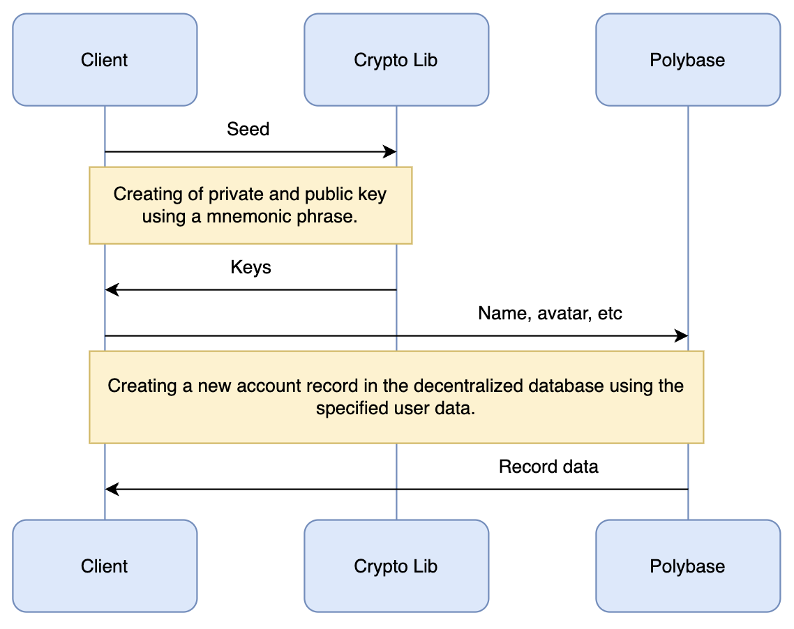

# 👤 Identity

## Creation

For convenience, the creation of a new digital identity can be divided into two parts, private and public.

1. The private part is always executed on the client and is responsible for creating a pair of private and public keys using the user's mnemonic phrase.
2. The public part is responsible for creating a new account record in the decentralized database. The data of which will be public for everyone to read and can be used in any dApp to identify you.

<figure><figcaption></figcaption></figure>
